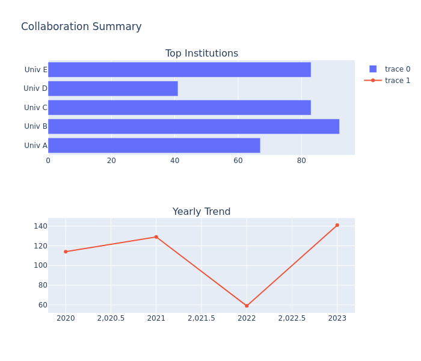

# OpenAlex Collaboration Analysis Tools

<div align="center">
  
  <p><em>Example of Institution Collaboration Network</em></p>
</div>

This repository contains tools for analyzing institutional collaborations using the OpenAlex API. The tools help visualize collaboration networks, trends, and patterns between academic institutions.

<details>
<summary>📊 Example Visualizations</summary>

### Global Collaboration Map


### Collaboration Trends


### Analysis Summary


</details>

## 🚀 Features

- **Institution Data Fetching**: Retrieve and save data about academic institutions worldwide
- **Collaboration Analysis**: Analyze collaboration patterns between institutions
- **Visualizations**:
  - Interactive network graphs of institutional collaborations
  - Global collaboration distribution maps
  - Time-series analysis of collaboration trends
  - Summary dashboards
  - Top collaborating institutions networks

## 📋 Prerequisites

First, clone the repository and install the required packages:

```bash
git clone https://github.com/yourusername/OpenAlex.git
cd OpenAlex
pip install -r requirements.txt
```

Required packages:
- pandas>=1.5.0
- networkx>=3.0
- plotly>=5.13.0
- requests>=2.28.0
- country_converter>=1.0.0
- numpy>=1.23.0

## 🛠️ Usage

### 1. Fetch Institution Data

First, fetch and save institution data from OpenAlex:

```bash
python fetch_institutions.py
```

This creates a directory `institution_data_TIMESTAMP` containing:
- `institutions_full.csv`: Complete dataset with all institution details
- `institutions_simple.csv`: Simplified version with key fields
- `top_institutions.md`: Markdown file listing top 100 institutions
- `summary.txt`: Summary statistics about the institutions

### 2. Run Collaboration Analysis

To analyze collaborations for a specific institution:

```bash
python run_analysis.py
```

Before running, update these parameters in `run_analysis.py`:
```python
institution_id = "I2802101240"  # Your target institution ID
email = "your-email@example.com"  # Your email for API access
```

This creates a directory `results_INSTITUTION-ID_INSTITUTION-NAME_TIMESTAMP` containing:

#### Generated Files
1. **Raw Data**
   - `collaboration_data.csv`: Raw collaboration data

2. **Interactive Visualizations**
   - `collaborations_over_time.html`: Time series of collaboration counts
   - `collaboration_map.html`: Global distribution of collaborations
   - `collaboration_trends.html`: Trends with top collaborating countries
   - `institution_network_top20.html`: Network of top 20 collaborating institutions
   - `institution_network_top50.html`: Network of top 50 collaborating institutions
   - `collaboration_summary.html`: Summary dashboard

3. **Network Data**
   - `collaboration_network.gexf`: Network graph file (can be opened with Gephi)

## 📊 Visualization Types

### 1. Institution Network
- Shows collaboration relationships between institutions
- Node size indicates collaboration frequency
- Interactive hovering shows collaboration details
- Available in two versions: top 20 and top 50 institutions

### 2. Global Collaboration Map
- Choropleth map showing global collaboration distribution
- Color intensity indicates collaboration frequency
- Uses country_converter for accurate country naming
- Interactive tooltips with collaboration counts

### 3. Collaboration Trends
- Time series visualization of collaboration patterns
- Shows trends for top collaborating countries
- Interactive legend for filtering countries
- Hover information for detailed counts

### 4. Summary Dashboard
- Combined view of collaboration metrics
- Top collaborating institutions bar chart
- Yearly collaboration trend line
- Overall collaboration statistics

## 🔍 Finding Institution IDs

### Method 1: Using fetch_institutions.py
1. Run `fetch_institutions.py`
2. Check generated files:
   - `institutions_simple.csv`
   - `top_institutions.md`

### Method 2: Direct API Access
- Base URL: `https://api.openalex.org/institutions`
- Search endpoint: `https://api.openalex.org/institutions?search=INSTITUTION_NAME`

### Common Institution IDs
```python
INSTITUTION_IDS = {
    'Harvard University': 'I127803138',
    'Stanford University': 'I127803157',
    'MIT': 'I127803157',
    'University of Oxford': 'I127803157',
    'University of Cambridge': 'I127803160'
}
```

## ⚙️ Configuration Options

### fetch_institutions.py
```python
max_pages = 50  # Number of pages to fetch
per_page = 200  # Results per page
```

### run_analysis.py
```python
start_year = 2020  # Start year for analysis
end_year = 2023    # End year for analysis
top_n = 20        # Number of top institutions to show
```

## 📝 Data Fields

### Institution Data
- `openalex_id`: Unique identifier
- `display_name`: Institution name
- `country_code`: ISO country code
- `type`: Institution type
- `works_count`: Number of publications
- `cited_by_count`: Citation count

### Collaboration Data
- `year`: Publication year
- `collaborating_institution`: Partner institution name
- `country`: Collaborator's country code
- `work_id`: Publication identifier

## 🤝 Contributing

1. Fork the repository
2. Create a feature branch
3. Commit your changes
4. Push to the branch
5. Create a Pull Request

## 📄 License

This project is licensed under the MIT License - see the [LICENSE](LICENSE) file for details.

## 🙏 Acknowledgments

- [OpenAlex](https://openalex.org/) for the comprehensive research data API
- [Plotly](https://plotly.com/) for interactive visualization capabilities
- [NetworkX](https://networkx.org/) for network analysis tools
- [country_converter](https://github.com/konstantinstadler/country_converter) for country code handling

## 📧 Contact

For questions or feedback:
- Create an [Issue](https://github.com/yourusername/OpenAlex/issues)
- Email: your-email@example.com

## 📚 Additional Resources

- [OpenAlex API Documentation](https://docs.openalex.org/)
- [Plotly Python Documentation](https://plotly.com/python/)
- [NetworkX Documentation](https://networkx.org/documentation/stable/) 